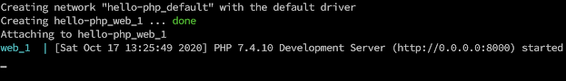
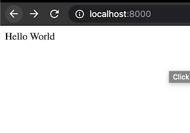
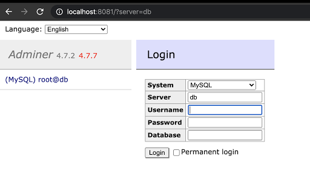
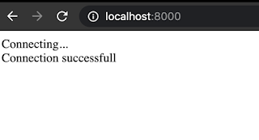

Hello All, welcome to my first blog.

Let's check how can we run the legacy php and mysql combo on any platform using docker.


If you are new to docker check resources on their official website [here](https://docs.docker.com/get-started/resources/ "Docker") or check their docker 101 playlist [here](https://youtube.com/watch?v=6gJs0F8V3tM&list=PLkA60AVN3hh8hNjc0fQ5_uJYIrS7s1JLW "Youtube").


Now, Assuming you have docker installed on your machine let's start.

We will first create a hello world project in php, for that:

- Create a folder let's say : hello-php
- Create a file : index.php
- Write the below code in that file and save it:
    ```php
    <?php
        echo "Hello world! from docker";
    ?>
    ```
- Create a new file in the same folder called: docker-compose.yml and put the below content : 
```yaml
    version: "3.8"
    services:
    web:
        image: php:7.4.10-alpine
        volumes:
        - .:/code
        ports:
        - "8000:8000"
        command: php -S 0.0.0.0:8000 -t /code
```

 - Run the below command ( it will download the php image )
    ```bash
    docker-compose up
    ```
- You should see something like this after the download finishes:

    


- Server starts at localhost:8000. Now simply navigate to http://localhost:8000 on your browser and you'll see this:

    


### Now let's connect to mysql db :

Add mysql and adminer images in your existing docker-compose.yml it should look like this:
```yaml
version: "3.8"
services:
  web:
    image: php:7.4.10-alpine
    volumes:
      - .:/code
    ports:
      - "8000:8000"
    command: php -S 0.0.0.0:8000 -t /code
  db:
    image: mysql:5.6
    command: --default-authentication-plugin=mysql_native_password
    environment: 
      MYSQL_ROOT_PASSWORD: secret_1
  adminer:
    image: adminer
    ports:
      - "8081:8080"
```

Run the same docker-compose command this time with option -d
```bash
docker-compose up -d
```

You won't see any logs now, since -d tells docker-compose to run it as detached mode.

Navigate to browser and open localhost:8081

you should see adminer login page: 




Try login with username: root and password: secret_1 and you should be able to login.


Now that we have php and mysql up and running, let's connect our hello-php application with the mysql db.


To be able to run php with mysql we need to download mysql extension for php. Follow the below steps:

 - Create a directory say php-with-mysql
`cd php-with-mysql`
 - Create a file named Dockerfile
write the below code
    ```Dockerfile
    FROM php:7.4-alpine
    RUN docker-php-ext-install pdo_mysql
    ```
 - run : `docker build -t php-with-mysql:7.4.10-alpine .`
It will create a new image on your local system with tag 7.4.10-alpine, we'll use this image in our docker-compose.yml
 


Now let's update our docker-compose.yml file it should look like below: 
```yaml
version: "3.8"
services:
  web:
    image: php-with-mysql:7.4.10-alpine
    container_name: hello-web
    volumes:
      - .:/code
    ports:
      - "8000:8000"
    command: php -S 0.0.0.0:8000 -t /code
  db:
    image: mysql:5.6
    container_name: hello-db
    command: --default-authentication-plugin=mysql_native_password
    environment: 
      MYSQL_ROOT_PASSWORD: secret_1
      MYSQL_DATABASE: hellodb
      MYSQL_USER: hello_user
      MYSQL_PASSOWRD: hello_password
  adminer:
    image: adminer
    ports:
      - "8081:8080"
```

Now let's connect our php file with this database, for that you need to add below code:
```php
<?php
echo "Connecting...<br />";
try
{
	$databaseServerName='hello-db';
	$databaseName='hellodb';
	$databaseUsername='hello-user';
	$databasePassword='hello-pass';
	$c=new PDO("mysql:host=$databaseServerName;dbname=$databaseName",$databaseUsername,$databasePassword);
	$c->setAttribute(PDO::ATTR_ERRMODE,PDO::ERRMODE_EXCEPTION);
	echo "Connection successful\n";
}catch(Exception $e)
{
	echo $e;
} 
?>
```

This is simple PDO code to establish a connection with mysql db.

Now we need to do some clean up of our existing container before we update the containers.

This is required because mysql won't get updated with the new values provided unless we stop and remove the existing container.

run `docker ps`  
copy the name/id of the container running mysql  
run `docker stop <name/id>`  
run `docker rm <name/id>`  

Now we are ready to update the containers with updated yaml file.

run `docker-compose up -d`

Navigate to http://localhost:8000

Connection successful shown



Now we learned how to create a Docker image locally, Run a db with a web server using docker compose, and some php PDO. 

Let me konw your feedbacks and questions [here](mailto:kmeetesh@gmail.com).

Thanks!